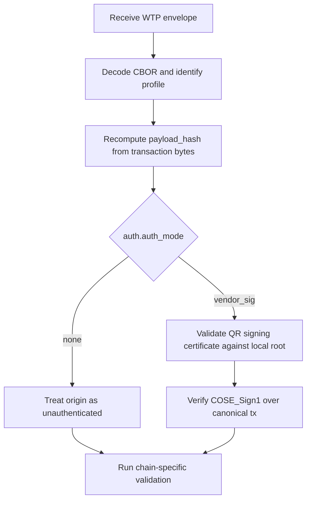

# WTP Trust Model

中文：[WTP 信任模型](02-trust-model.zh-CN.md)

## 1. Trust Anchors

`WTP` separates discovery from trust.

- Domain names and GitHub repositories MAY be used for publication and audit.
- They MUST NOT be treated as the final trust anchor.
- The final trust anchor MUST be a locally trusted vendor root fingerprint or root certificate.

## 2. Trust Chain

The recommended verification chain is:

```text
Vendor Root -> QR Signing Certificate -> COSE_Sign1 over tx
```

## 3. auth Objects

`WTP-v1` uses two different `auth` objects. Implementations MUST NOT apply one schema to the other.

### 3.1 Envelope Auth

Envelope auth is the `WtpEnvelope.auth` object defined by [01 Envelope](01-envelope.md#4-auth-requirements). It authenticates a single envelope `tx` record.

```text
EnvelopeAuth = {
  auth_mode,        // none | vendor_sig
  vendor_id,
  signing_key_id,
  algorithm,
  signature,
  signing_cert,
  root_fingerprint
}
```

- `auth_mode = none` means no cryptographic origin verification is supplied.
- `auth_mode = vendor_sig` means `signature` is a detached `COSE_Sign1` over `canonical_CBOR(tx)`.
- `signing_cert` is the QR signing certificate whose public key verifies `signature`.
- `root_fingerprint` identifies the vendor root expected to validate `signing_cert`.

### 3.2 Trust Metadata Auth

Trust metadata auth is the `WtpTrustMetadata.auth` object defined by [03 Discovery and Publishing](03-discovery-and-publishing.md#5-metadata-signature). It authenticates a published trust bundle, not a transaction envelope.

```text
TrustMetadataAuth = {
  auth_mode,        // none | root_sig
  root_fingerprint,
  signing_key_id,
  algorithm,
  signature
}
```

- `auth_mode = none` means the metadata is unsigned and MUST NOT be trusted by default when fetched remotely.
- `auth_mode = root_sig` means `signature` is a detached `COSE_Sign1` over the canonical metadata body excluding `auth`.
- `root_fingerprint` identifies the locally trusted vendor root that verifies the metadata signature.

## 4. Verification Procedure

A verifier SHOULD perform these checks in order:

1. Decode the envelope and identify `chain_family` and `profile`.
2. Recompute the transaction payload hash from the raw transaction bytes (see [05 Calculation and Verification](05-calculation-and-verification.md#3-payload-hash-calculation)).
3. If envelope `auth.auth_mode = vendor_sig`, validate the signing certificate against a locally trusted root.
4. Verify the detached COSE signature over the canonical `tx` CBOR bytes.
5. Perform chain-specific simulation using an independent RPC source.

The phrase locally trusted root means a root fingerprint or root certificate already installed or approved by verifier-local policy. A root merely discovered through HTTPS, GitHub, or `/.well-known/wtp/` is distribution material until it matches local trust policy.



## 5. Publication

Vendors MAY publish public trust materials through:

- GitHub
- HTTPS
- `/.well-known/` endpoints

Published materials SHOULD include:

- root public key or root certificate
- signing certificate metadata
- revocation metadata
- status metadata
- historical versions

These published materials are for transparency and distribution. They are not the primary trust anchor.
