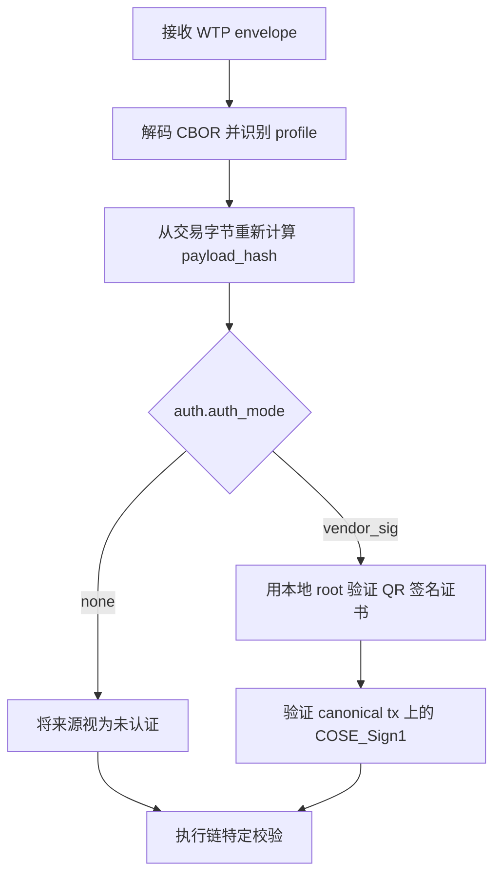

# WTP 信任模型

English: [WTP Trust Model](02-trust-model.md)

## 1. 信任锚

`WTP` 将发现机制与信任机制分离。

- 域名和 GitHub 仓库可以用于发布和审计。
- 它们不得被视为最终信任锚。
- 最终信任锚必须是本地信任的厂商根指纹或根证书。

## 2. 信任链

推荐验证链为：

```text
Vendor Root -> QR Signing Certificate -> COSE_Sign1 over tx
```

## 3. auth 对象

`WTP-v1` 使用两个不同的 `auth` 对象。实现方不得把其中一个 schema 套用到另一个场景。

### 3.1 Envelope Auth

Envelope auth 是 [01 Envelope](01-envelope.zh-CN.md#4-auth-要求) 定义的 `WtpEnvelope.auth` 对象，用来认证单个 envelope 的 `tx` 记录。

```text
EnvelopeAuth = {
  auth_mode,        // none | vendor_sig
  vendor_id,
  signing_key_id,
  algorithm,
  signature,
  signing_cert,
  root_fingerprint
}
```

- `auth_mode = none` 表示没有提供密码学来源验证。
- `auth_mode = vendor_sig` 表示 `signature` 是对 `canonical_CBOR(tx)` 的 detached `COSE_Sign1`。
- `signing_cert` 是 QR 签名证书，其公钥用于验证 `signature`。
- `root_fingerprint` 标识预期用于验证 `signing_cert` 的厂商根。

### 3.2 Trust Metadata Auth

Trust metadata auth 是 [03 发现与发布](03-discovery-and-publishing.zh-CN.md#5-metadata-签名) 定义的 `WtpTrustMetadata.auth` 对象，用来认证发布的信任包，而不是交易 envelope。

```text
TrustMetadataAuth = {
  auth_mode,        // none | root_sig
  root_fingerprint,
  signing_key_id,
  algorithm,
  signature
}
```

- `auth_mode = none` 表示 metadata 未签名；远程获取时，验证器默认不得信任。
- `auth_mode = root_sig` 表示 `signature` 是对不含 `auth` 的 canonical metadata body 的 detached `COSE_Sign1`。
- `root_fingerprint` 标识用于验证 metadata 签名的本地信任厂商根。

## 4. 验证流程

验证器应该按以下顺序执行检查：

1. 解码 envelope，并识别 `chain_family` 和 `profile`。
2. 从原始交易字节重新计算交易 payload hash（见 [05 计算与校验](05-calculation-and-verification.zh-CN.md#3-payload-hash-计算)）。
3. 如果 envelope `auth.auth_mode = vendor_sig`，用本地信任根验证签名证书。
4. 对 canonical `tx` CBOR 字节验证 detached COSE 签名。
5. 使用独立 RPC 来源执行链特定模拟。

本地信任根指已经由验证器本地策略安装或批准的根指纹或根证书。仅通过 HTTPS、GitHub 或 `/.well-known/wtp/` 发现的 root 只是分发材料，必须匹配本地信任策略后才可作为信任锚。



## 5. 发布

厂商可以通过以下渠道发布公开信任材料：

- GitHub
- HTTPS
- `/.well-known/` endpoints

发布材料应该包含：

- 根公钥或根证书；
- 签名证书 metadata；
- 吊销 metadata；
- 状态 metadata；
- 历史版本。

这些公开材料用于透明度和分发，不是主要信任锚。
